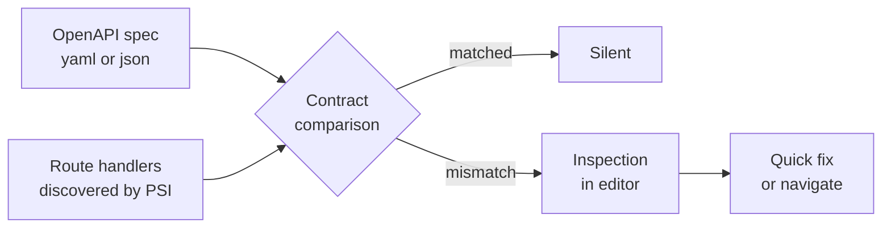

<div align="center">


[](https://github.com/jaf-git/api-contract-validator/actions/workflows/build.yml)
[](https://codecov.io/gh/jaf-git/api-contract-validator)
[](https://kotlinlang.org)
[](https://plugins.jetbrains.com/docs/intellij/welcome.html)
[](LICENSE)

</div>

<!-- Plugin description -->
Your OpenAPI specification says one thing. Your controllers do another. Nobody notices until a client breaks in production.

API Contract Validator checks your backend implementation against your OpenAPI specification without leaving the IDE. It reads your spec, walks your route handlers, and reports every place the two disagree — missing endpoints, wrong HTTP methods, schema drift, undeclared status codes — as ordinary editor inspections you can click straight to.

No CI round-trip, no separate tool, no waiting for a consumer to file a bug. The mismatch is underlined while you type.
<!-- Plugin description end -->

<br>

> [!IMPORTANT]
> The two `<!-- Plugin description -->` markers above are load-bearing. The Gradle `patchPluginXml` task extracts everything between them into `plugin.xml` as your Marketplace listing. Delete them and the build breaks. Keep that block free of badges, Mermaid, and collapsible sections — it has to convert cleanly to HTML.

<br>

## The problem, in one screen

<table>
<tr><th width="50%">The spec promises</th><th width="50%">The code delivers</th></tr>
<tr><td>

```yaml
/orders/{id}:
  get:
    responses:
      '200':
        content:
          application/json:
            schema:
              required: [id, total, currency]
```

</td><td>

```kotlin
@GetMapping("/orders/{orderId}")
fun getOrder(...): OrderDto

data class OrderDto(
  val id: String,
  val total: BigDecimal
  // currency: never implemented
)
```

</td></tr>
</table>

Three defects hiding in nine lines: the path parameter is named differently, `currency` is promised but absent, and nothing declares the 404 the handler can actually throw. All three ship silently today.

<br>

## How it works



The plugin indexes your specification and resolves your annotated handlers through the IntelliJ PSI tree, so it follows renames and refactors the same way the IDE does. Comparison runs incrementally on the file you are editing rather than over the whole project.

<br>

## What it catches

<details>
<summary><b>Endpoint declared in the spec but never implemented</b></summary>
<br>

The spec advertises an operation that no handler serves. Clients generated from this spec will call it and get a 404.

```
Spec declares GET /orders/{id}/refunds — no handler found
```

Reported on the spec file, at the operation.

</details>

<details>
<summary><b>Handler with no corresponding spec operation</b></summary>
<br>

The reverse case, and the more dangerous one: an undocumented endpoint is still a public endpoint. Often an internal route someone forgot was reachable.

```
POST /admin/reindex is not present in the specification
```

</details>

<details>
<summary><b>HTTP method mismatch</b></summary>
<br>

Same path, different verb. Usually the result of a spec edit that never made it into the code, or a handler changed from `PUT` to `PATCH` without updating the document.

</details>

<details>
<summary><b>Path parameter name or type mismatch</b></summary>
<br>

The spec says `{id}`, the handler binds `{orderId}`. Frameworks tolerate this; generated clients and documentation readers do not. Type mismatches — spec says `integer`, handler takes `String` — are reported separately.

</details>

<details>
<summary><b>Request and response schema drift</b></summary>
<br>

A field promised in the schema is missing from the DTO, or a DTO field never appears in the spec. Also flags required/optional disagreement, where the spec marks a field required and the type declares it nullable.

</details>

<details>
<summary><b>Undeclared status codes</b></summary>
<br>

A handler can return 409, the spec documents only 200 and 400. Consumers write no branch for it.

</details>

> Trim this list to what is actually implemented before publishing. A check documented but absent is the one thing a Marketplace reviewer will find.

<br>

## Install

<details open>
<summary><b>From the IDE</b></summary>
<br>

`Settings` → `Plugins` → `Marketplace` → search **API Contract Validator** → `Install`

</details>

<details>
<summary><b>From JetBrains Marketplace</b></summary>
<br>

Open the [Marketplace listing](https://plugins.jetbrains.com/plugin/MARKETPLACE_ID) and press `Install to ...` with your IDE running. Or download a build from [Versions](https://plugins.jetbrains.com/plugin/MARKETPLACE_ID/versions) and use `Settings` → `Plugins` → `⚙️` → `Install plugin from disk...`

</details>

<details>
<summary><b>From a release archive</b></summary>
<br>

Grab the [latest release](https://github.com/jaf-git/api-contract-validator/releases/latest) and install it with `Settings` → `Plugins` → `⚙️` → `Install plugin from disk...`

</details>

<br>

## Set up

Point the plugin at your specification in `Settings` → `Tools` → `API Contract Validator`. It looks in the usual places first — `src/main/resources/openapi.yaml`, `api/openapi.yaml`, and the project root.

| Setting | Default | What it does |
|---|---|---|
| Specification path | auto-detected | Location of your OpenAPI document |
| Base path | `/` | Prefix stripped before matching routes |
| Severity | Warning | Inspection level for contract mismatches |
| Ignore patterns | none | Glob patterns for paths to skip, such as `/internal/**` |

Per-check severity is configurable under `Settings` → `Editor` → `Inspections` → `API Contract Validator`.

<br>

## Build from source

```bash
git clone https://github.com/jaf-git/api-contract-validator.git
cd api-contract-validator

./gradlew runIde         # launch a sandbox IDE with the plugin loaded
./gradlew test           # run the test suite
./gradlew verifyPlugin   # plugin verifier — do this before every release
./gradlew buildPlugin    # produces build/distributions/*.zip
```

Requires JDK 17 or later. Gradle comes via the wrapper.

<br>

## Before the Marketplace listing goes live

- [ ] Replace both `MARKETPLACE_ID` placeholders above with the real plugin ID
- [ ] Add the version and download badges back once the ID exists
- [ ] Set `pluginGroup`, `pluginName` and `pluginVersion` in `gradle.properties`
- [ ] Set the plugin `id` and vendor block in `src/main/resources/META-INF/plugin.xml`
- [ ] Add `CHANGELOG.md` entries under an `[Unreleased]` heading — the release workflow reads them
- [ ] Configure plugin signing secrets (`CERTIFICATE_CHAIN`, `PRIVATE_KEY`, `PRIVATE_KEY_PASSWORD`)
- [ ] Configure the `PUBLISH_TOKEN` deployment secret
- [ ] Configure `CODECOV_TOKEN` for coverage reports on pull requests
- [ ] Run `./gradlew verifyPlugin` against every IDE version in your compatibility range
- [ ] Add a repository description and topics — `intellij-plugin`, `openapi`, `kotlin`, `api-contract`
- [ ] Add screenshots or a short GIF of an inspection firing

<br>

## Contributing

Issues and pull requests welcome. For a new check, open an issue describing the mismatch it detects and a minimal spec-plus-handler pair that triggers it.

<br>

## License

MIT. See [LICENSE](LICENSE).

<div align="center">
<sub>Built on the <a href="https://github.com/JetBrains/intellij-platform-plugin-template">IntelliJ Platform Plugin Template</a></sub>
</div>
